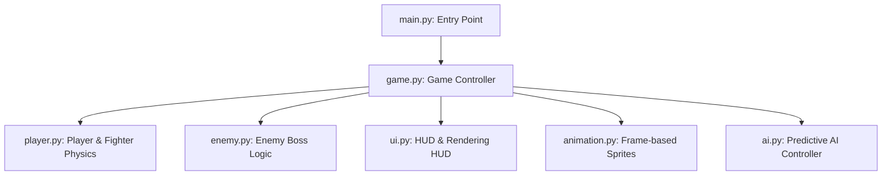

# Project Report: Ninja Duel: Adaptive Warrior
## Game Architecture and Multi-Layer Perceptron (MLP) AI Integration

**Course:** Neural Networks & Machine Learning (CS Y2 SEM 2)  
**Project:** Ninja Duel: Adaptive Warrior  
**Implementation Platform:** Python / Pygame-CE  

---

## 1. Executive Summary
*Ninja Duel: Adaptive Warrior* is a real-time, 2D platform-based fighting game designed to demonstrate adaptive agent behaviors in a competitive simulation. Built using object-oriented principles in Python with `pygame-ce` for rendering and physics, the game pits a human-controlled fighter against an intelligent opponent. 

To bridge traditional game heuristics with modern neural network architectures, this report details both the current **frequency-count predictive AI** and the implementation design for a **Multi-Layer Perceptron (MLP)** neural network. The MLP acts as a real-time classifier, taking in multi-dimensional spatial, state, and temporal game metrics to predict player behavior and choose optimal counter-actions.

---

## 2. Game Overview & Core Mechanics
The game features two warriors fighting on a horizontal stage. The objective of the player is to deplete the enemy's health while managing their own health and positioning.

### 2.1 Character Attribute State Space
Each fighter (inheriting from the base `Fighter` class) possesses the following attributes:
*   **Health Points ($HP$):** Range $[0, 100]$. Default starting value is $100$.
*   **Attack Damage ($AD$):** Base value is $15$.
*   **Heal Capacity ($H$):** Restores $10$ HP per success, capped at $100$.
*   **Defense Modifier ($\alpha$):** Activates a defensive stance. Incoming damage is scaled by $\alpha = 0.3$ (i.e., $70\%$ damage reduction).
*   **Spatial Position ($x, y$):** Restrained to horizontal bounds $x \in [80, 920]$ and ground-level $y = 700$.

### 2.2 Core Combat Actions
At any given frame (subject to action cooldowns), a combatant can execute one of three discrete combat actions:
1.  **Attack:** If the opponent is within `ATTACK_RANGE` ($130$ pixels) and is on the ground, the opponent takes damage. If the opponent is jumping (airborne), the attack is evaded (dodge mechanic).
2.  **Defend:** Activates a temporary shield lasting for $0.65$ seconds. Reduces incoming damage by $70\%$.
3.  **Heal:** Restores $10$ HP. Fails if the fighter is already at maximum HP.

### 2.3 Real-time Spacing & Physics
Fighters move horizontally at a speed of $300\text{ px/s}$. They can jump at an initial upward velocity of $-650\text{ px/s}$, subjected to gravitational acceleration of $1800\text{ px/s}^2$. The spacing between fighters is dynamically computed:
$$\text{Distance } (D) = |x_{\text{player}} - x_{\text{enemy}}|$$
To prevent clipping, fighters have a minimum spacing threshold of $85\text{ pixels}$ unless jumping over each other. 

### 2.4 Boss Phase State Transition
A dynamic threshold triggers a shift in the enemy behavior:
$$\text{State}_{\text{Boss}} = \begin{cases} \text{True} & \text{if } 0 < HP_{\text{enemy}} < 30 \\ \text{False} & \text{otherwise} \end{cases}$$
Upon entering the **Boss Phase**:
*   The enemy's attack damage increases from $15$ to $25$.
*   The enemy's action cooldown decreases from $0.75\text{s}$ to $0.50\text{s}$.
*   The movement speed multiplier increases to $1.2$.
*   The behavior changes to favor aggressive attack profiles.

---

## 3. System Architecture
The codebase is structured under clean object-oriented divisions, ensuring separation of concerns between state rendering, physics engine, and decision-making modules.



### 3.1 Codebase File Layout
*   [main.py](file:///d:/CS%20Y2/SEM%202/neural%20network/ninja%20duel/main.py): Launches the game.
*   [game.py](file:///d:/CS%20Y2/SEM%202/neural%20network/ninja%20duel/game.py): Governs the game loop, keyboard input handling, collision resolution, combat logic, and cooldown timers.
*   [player.py](file:///d:/CS%20Y2/SEM%202/neural%20network/ninja%20duel/player.py): Defines physical movements (run, jump), gravity application, boundaries, damage reception, and scoring.
*   [enemy.py](file:///d:/CS%20Y2/SEM%202/neural%20network/ninja%20duel/enemy.py): Inherits from `Fighter` and extends attributes for the high-intensity boss phase.
*   [ai.py](file:///d:/CS%20Y2/SEM%202/neural%20network/ninja%20duel/ai.py): Houses the decision-making logic of the opponent (current frequency-based method and proposed MLP model).
*   [ui.py](file:///d:/CS%20Y2/SEM%202/neural%20network/ninja%20duel/ui.py): Renders the background, health bars, battle logs, action overlays, and scores.
*   [animation.py](file:///d:/CS%20Y2/SEM%202/neural%20network/ninja%20duel/animation.py): Tracks animation timers and slice indexes for idle, running, attacking, hit, jumping, and death sprites.

---

## 4. Current Heuristic AI vs. Multi-Layer Perceptron (MLP) AI
To understand the advantage of integrating an MLP, it is useful to contrast it with the current game implementation.

### 4.1 The Current Heuristic Engine
The current AI tracks the player's action selection frequencies. Let $N_{\text{Attack}}, N_{\text{Defend}}, N_{\text{Heal}}$ be the cumulative counts of player actions recorded during the battle. The AI predicts the next action $\hat{y}$ using a simple majority heuristic:
$$\hat{y} = \arg\max_{a \in \mathcal{A}} (N_a)$$
where $\mathcal{A} = \{\text{Attack}, \text{Defend}, \text{Heal}\}$. Once predicted, the AI queries a hardcoded counter-policy:
*   If $\hat{y} = \text{Attack} \implies$ AI defends or attacks.
*   If $\hat{y} = \text{Heal} \implies$ AI attacks.
*   If $\hat{y} = \text{Defend} \implies$ AI attacks or heals.

#### Limitations:
1.  **Context Blindness:** It ignores spatial spacing ($D$) and physical health levels ($HP_P$, $HP_E$). For example, if a player is at low health, they are highly likely to heal, but the frequency table will still predict "Attack" if the player attacked frequently in the early game.
2.  **No Sequence Recognition:** It treats actions as independent, failing to recognize simple patterns (e.g., "Run Forward $\rightarrow$ Jump $\rightarrow$ Attack").
3.  **Linear Decoupled Decisions:** Movement and combat actions are evaluated in isolation.

### 4.2 The Multi-Layer Perceptron (MLP) AI Model
An MLP resolves these limits by approximating a non-linear mapping from a multi-dimensional game state vector directly to action probability distributions.

```
       [Input Vector X] (12 Features)
              |
        (Weight W1, Bias b1)
              v
     [Hidden Layer 1] (16 Neurons + ReLU)
              |
        (Weight W2, Bias b2)
              v
     [Hidden Layer 2] (8 Neurons + ReLU)
              |
        (Weight W3, Bias b3)
              v
     [Output Layer] (3 Neurons + Softmax)
              |
    [ Probabilities: Atk, Def, Heal ]
```

---

## 5. Mathematical Formulation of the MLP Model

### 5.1 Input Features Vector ($X$)
To make optimal choices, the network requires a combined snapshot of spatial metrics, vital statistics, and history. The feature vector $X \in \mathbb{R}^{12}$ is structured as follows:

| Index | Feature Description | Representation / Normalization |
|---|---|---|
| $x_1$ | Player Health Ratio | $HP_P / 100 \in [0.0, 1.0]$ |
| $x_2$ | Enemy Health Ratio | $HP_E / 100 \in [0.0, 1.0]$ |
| $x_3$ | Inter-Fighter Distance | $D / 1000 \in [0.0, 1.0]$ (Scaled by max screen width) |
| $x_4$ | Player Airborne State | $1.0$ if player is jumping, else $0.0$ |
| $x_5$ | Player Defending State | $1.0$ if player is in defend cooldown, else $0.0$ |
| $x_6$ | Boss Phase Active flag | $1.0$ if boss phase triggered, else $0.0$ |
| $x_7, x_8, x_9$ | Player's Last Action ($t-1$) | One-hot encoded vector of size 3 (Attack, Defend, Heal) |
| $x_{10}, x_{11}, x_{12}$ | Player's Second Last Action ($t-2$) | One-hot encoded vector of size 3 (Attack, Defend, Heal) |

### 5.2 Forward Propagation Mathematics
Let $l \in \{1, 2, 3\}$ denote the layers of the MLP (where $l=3$ is the output layer).
The pre-activation vector for layer $l$ is calculated as:
$$Z^{[l]} = W^{[l]} A^{[l-1]} + B^{[l]}$$
where:
*   $A^{[0]} = X$ (the input layer).
*   $W^{[l]}$ is the weight matrix of shape $(N_l, N_{l-1})$.
*   $B^{[l]}$ is the bias vector of shape $(N_l, 1)$.

#### Activation Functions:
For hidden layers ($l=1, 2$), we apply the **Rectified Linear Unit (ReLU)** activation to introduce non-linearity, allowing the AI to learn complex spatial boundaries (e.g., healing is only viable when distance is large or the player is defending):
$$A^{[l]} = \max(0, Z^{[l]})$$

For the output layer ($l=3$), we apply the **Softmax** function to project the raw activations (logits) into a probability distribution over the 3 combat classes:
$$A^{[3]} = \text{Softmax}(Z^{[3]})$$
$$a^{[3]}_i = \frac{e^{z^{[3]}_i}}{\sum_{j=1}^{3} e^{z^{[3]}_j}}$$
where $a^{[3]} = [P(\text{Attack}), P(\text{Defend}), P(\text{Heal})]^T$.

### 5.3 Training and Optimization
The network is trained to classify the player's next move. This is framed as a supervised learning task.

#### Loss Function
We use the **Categorical Cross-Entropy Loss** to measure the discrepancy between the network's predicted action distribution $A^{[3]}$ and the player's actual action $Y$ (one-hot encoded vector):
$$\mathcal{L}(W, B) = -\sum_{i=1}^{3} y_i \log\left(a^{[3]}_i\right)$$

#### Backward Propagation (Gradient Descent)
To update the weights and biases, the loss gradient is backpropagated through the network:
1.  **Output Error:**
    $$\delta^{[3]} = A^{[3]} - Y$$
2.  **Hidden Layer Errors (using the chain rule):**
    $$\delta^{[l]} = \left(W^{[l+1]T} \delta^{[l+1]}\right) \odot f'(Z^{[l]})$$
    where $\odot$ represents the Hadamard (element-wise) product, and $f'(z)$ is the derivative of the ReLU function:
    $$f'(z) = \begin{cases} 1 & \text{if } z > 0 \\ 0 & \text{otherwise} \end{cases}$$
3.  **Parameter Gradients:**
    $$\frac{\partial \mathcal{L}}{\partial W^{[l]}} = \delta^{[l]} A^{[l-1]T}$$
    $$\frac{\partial \mathcal{L}}{\partial B^{[l]}} = \delta^{[l]}$$
4.  **Parameter Updates:**
    $$W^{[l]} \leftarrow W^{[l]} - \eta \frac{\partial \mathcal{L}}{\partial W^{[l]}}$$
    $$B^{[l]} \leftarrow B^{[l]} - \eta \frac{\partial \mathcal{L}}{\partial B^{[l]}}$$
    where $\eta$ represents the learning rate (e.g., $\eta = 0.03$).

---

## 6. Practical Implementation & Integration Code
The following implementation represents the conversion of the conceptual MLP design into Python code. The model is written using **NumPy** to prevent dependency overhead inside the Pygame loop. It provides an offline training cycle and online evaluation hook.

```python
import numpy as np
import random

class MLPPredictor:
    def __init__(self):
        # Layer dimensions: Input (12) -> Hidden 1 (16) -> Hidden 2 (8) -> Output (3)
        self.input_dim = 12
        self.hidden1_dim = 16
        self.hidden2_dim = 8
        self.output_dim = 3
        
        # Weight Initialization (He Initialization for ReLU)
        self.W1 = np.random.randn(self.hidden1_dim, self.input_dim) * np.sqrt(2.0 / self.input_dim)
        self.b1 = np.zeros((self.hidden1_dim, 1))
        
        self.W2 = np.random.randn(self.hidden2_dim, self.hidden1_dim) * np.sqrt(2.0 / self.hidden1_dim)
        self.b2 = np.zeros((self.hidden2_dim, 1))
        
        self.W3 = np.random.randn(self.output_dim, self.hidden2_dim) * np.sqrt(2.0 / self.hidden2_dim)
        self.b3 = np.zeros((self.output_dim, 1))
        
        # Training memory buffer
        self.experience_buffer = []

    def relu(self, Z):
        return np.maximum(0, Z)

    def relu_derivative(self, Z):
        return (Z > 0).astype(float)

    def softmax(self, Z):
        shift_Z = Z - np.max(Z, axis=0, keepdims=True)  # Avoid numerical overflow
        exps = np.exp(shift_Z)
        return exps / np.sum(exps, axis=0, keepdims=True)

    def forward(self, X):
        """X is a 12-dimensional flat list or array."""
        a0 = np.array(X).reshape(-1, 1)
        
        # Layer 1
        z1 = np.dot(self.W1, a0) + self.b1
        a1 = self.relu(z1)
        
        # Layer 2
        z2 = np.dot(self.W2, a1) + self.b2
        a2 = self.relu(z2)
        
        # Layer 3 (Output)
        z3 = np.dot(self.W3, a2) + self.b3
        a3 = self.softmax(z3)
        
        return a3.flatten(), (a0, z1, a1, z2, a2, z3, a3)

    def record_experience(self, features, actual_action):
        """Log state features and player's action for offline training."""
        action_map = {"Attack": 0, "Defend": 1, "Heal": 2}
        if actual_action in action_map:
            target_idx = action_map[actual_action]
            y_one_hot = np.zeros((3, 1))
            y_one_hot[target_idx] = 1.0
            self.experience_buffer.append((features, y_one_hot))

    def train_on_buffer(self, learning_rate=0.03):
        """Train the neural network using backpropagation on recorded logs."""
        if len(self.experience_buffer) < 10:
            return  # Need sufficient data points
            
        for features, y_true in self.experience_buffer:
            # Forward Pass
            _, cache = self.forward(features)
            a0, z1, a1, z2, a2, z3, a3 = cache
            
            # Backpropagation
            # Loss gradient w.r.t z3
            delta3 = a3 - y_true
            dW3 = np.dot(delta3, a2.T)
            db3 = delta3
            
            # Layer 2 error
            delta2 = np.dot(self.W3.T, delta3) * self.relu_derivative(z2)
            dW2 = np.dot(delta2, a1.T)
            db2 = delta2
            
            # Layer 1 error
            delta1 = np.dot(self.W2.T, delta2) * self.relu_derivative(z1)
            dW1 = np.dot(delta1, a0.T)
            db1 = delta1
            
            # Update Parameters
            self.W3 -= learning_rate * dW3
            self.b3 -= learning_rate * db3
            self.W2 -= learning_rate * dW2
            self.b2 -= learning_rate * db2
            self.W1 -= learning_rate * dW1
            self.b1 -= learning_rate * db1
            
        # Clear buffer after learning pass
        self.experience_buffer.clear()
```

### 6.2 Modifying `ai.py` to use the MLP
To replace the count-based system in `ai.py`, we integrate the `MLPPredictor` and map its predictions to counter-actions.

```python
class AdaptiveMLPAI:
    def __init__(self):
        self.mlp = MLPPredictor()
        self.action_history = ["Attack", "Attack"]  # Initialize history buffer
        self.last_prediction = "None"

    def encode_features(self, player, enemy, distance, boss_phase):
        # 1. Normalize HP values
        player_hp = player.hp / 100.0
        enemy_hp = enemy.hp / 100.0
        
        # 2. Normalize distance (screen max width is 1000)
        norm_dist = min(distance / 1000.0, 1.0)
        
        # 3. Game states
        p_airborne = 1.0 if not player.on_ground else 0.0
        p_defending = 1.0 if player.is_defending else 0.0
        boss_active = 1.0 if boss_phase else 0.0
        
        # 4. Encode Action History (last 2 moves)
        action_map = {"Attack": [1, 0, 0], "Defend": [0, 1, 0], "Heal": [0, 0, 1]}
        h1 = action_map.get(self.action_history[-1], [0, 0, 0])
        h2 = action_map.get(self.action_history[-2], [0, 0, 0])
        
        # Assemble vector (Total: 12 elements)
        features = [player_hp, enemy_hp, norm_dist, p_airborne, p_defending, boss_active] + h1 + h2
        return features

    def choose_autonomous_action(self, enemy, player, distance, boss_phase=False):
        features = self.encode_features(player, enemy, distance, boss_phase)
        
        # Query MLP to predict player's next move
        probabilities, _ = self.mlp.forward(features)
        actions = ["Attack", "Defend", "Heal"]
        predicted_idx = np.argmax(probabilities)
        self.last_prediction = actions[predicted_idx]
        
        # Record experience for training updates
        # (This can be triggered when player commits an action in game.py)
        
        # Execute counter-tactics based on prediction
        if self.last_prediction == "Attack":
            # If player attacks, enemy should block or counter-strike
            return "Defend" if random.random() < 0.6 else "Attack"
        elif self.last_prediction == "Heal":
            # Intercept healing with attack
            return "Attack"
        elif self.last_prediction == "Defend":
            # If player blocks, use this time to heal or reposition
            return "Heal" if enemy.hp < 80 else "Attack"
            
        return random.choice(actions)
```

---

## 7. Comparative Assessment
| Metric | Frequency Counter AI (Current) | Multi-Layer Perceptron AI (MLP) |
|---|---|---|
| **Input Channels** | 1 (Only Player Action Label) | 12 (HP, Distance, Flags, Action History) |
| **Relationship Modeling** | Direct probability of occurrence | Complex, non-linear cross-interactions |
| **Adaptability** | Reactive to general player bias | Proactive to spacing, health levels, and state changes |
| **Spatial Awareness** | Poor (Requires manual custom-coded helper logic) | Native (Model weighs distance directly as an input node) |
| **Computational Overhead** | Negligible ($\mathcal{O}(1)$ frequency count lookup) | Very Low ($\mathcal{O}(W_l \cdot A_{l-1})$ matrix operations) |
| **Dynamic Complexity** | Static rules remain predictable over time | Generates dynamic, evolving tactics |

---

## 8. Conclusion
The current frequency-counting method is simple and explainable, but it is limited by its inability to adapt to the physical realities of the game state (like health or spacing). 

The proposed **Multi-Layer Perceptron (MLP)** integration bridges this gap. By utilizing a 12-dimensional state vector—incorporating spatial properties (distance), status flags (airborne, defending), and temporal dimensions (action history)—and processing it through two hidden layers with ReLU activations, the MLP provides a highly realistic, adaptive, and intelligent adversary. The model is computationally lightweight enough to run seamlessly in real-time inside Python's game loop, providing an interactive demonstrate of neural networks applied to game AI.
